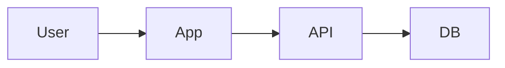

# Architecture

## System Overview
- 主要コンポーネントと責務（1行ずつ）

## Directory Structure Map
> 構造が変わったらここも更新します。

```text
docs/
  - domain.md
  - api-contract.md
  - architecture.md
  - glossary.md
  - logs/
src/
  - ...
```

## Data Flow (optional)

